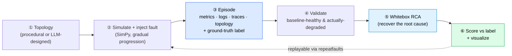
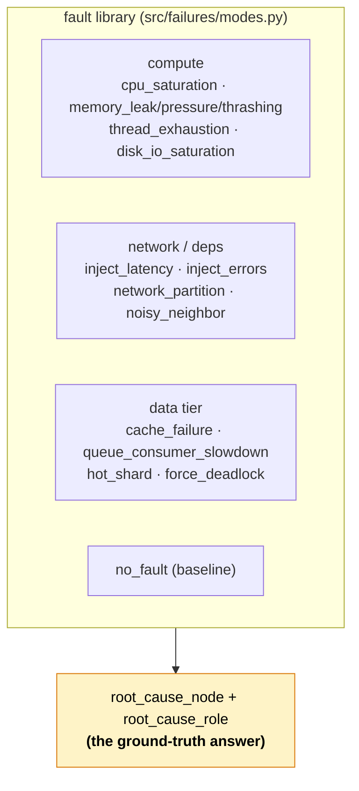
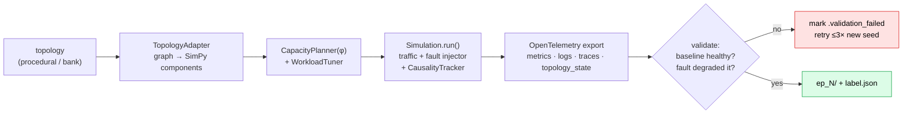
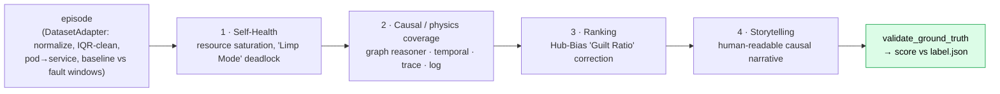

<div align="center">

# Dataraft

**A microservice-infrastructure simulator that manufactures ground-truth-labeled incidents — then tries to solve them.**

*Procedurally build realistic service topologies, inject a known fault, emit production-like (imperfect) telemetry with the exact root cause labeled, run a whitebox RCA engine against it, and score the answer. A closed benchmark loop for AI-in-SRE.*

Python · SimPy · NetworkX · OpenTelemetry · MIT

<sub>(the git remote is historically `samba`; the product is **Dataraft**.)</sub>

</div>

---

## Why it exists

You can't benchmark a root-cause-analysis tool in the real world, because in the real world **you rarely know the true root cause** — that's the whole problem. So RCA research has no ground truth to measure against.

Dataraft manufactures it. It procedurally generates diverse microservice topologies, injects a *known* fault at a *known* node with a *gradual*, physically-plausible progression, and emits metrics/logs/traces that look like real observability data — dropped samples, clock skew, noisy neighbors, cascades and all — alongside an exact `label.json` naming the root cause. Now an RCA algorithm can be developed, trained, and **scored against truth**, and hard cases (two faults with near-identical signatures) can be constructed on purpose.

---

## The closed loop

The whole system is one loop you can run end to end in a single repo — no external ML pipeline:



Every run is **fully replayable** from its `run_parameters.json` (topology, fault, root cause, fragility, timeline) — the `repeatfaults/history.jsonl` store turns any incident into a fixed regression case for RCA algorithms.

---

## ① The world: topologies

A topology is a directed microservice graph (NetworkX). Nodes are typed — `ApiService`, `SqlDatabase`, `InMemoryCache`, `MessageQueue`, `ExternalService`, `RequestGateway` — wired by typed edges (`sync_http`, `sync_db`, `sync_cache`, `async_produce/consume`, …) each with a base latency. Two ways to build them:

- **Procedural** (`src/topology/generator.py`) — random but realistic wiring, no API key.
- **LLM-designed** (`src/topology/llm_generator.py`) — Claude designs *named, domain-flavored* architectures across archetypes (hierarchical, mesh, pipeline, hub-spoke) with request flows and semantic metadata. Pre-generate a **topology bank** offline (`generate_topology_bank.py`) and draw from it at dataset time.

---

## ② The incident: gradual fault injection

A fault isn't flipped on instantly — it **ramps** (linear / exponential / step) through phases (warmup → fault_start → ramp → full_effect → recovery), so the telemetry shows realistic onset and propagation. ~17 fault modes live in `src/failures/modes.py`, each with a clean revert:



Realism knobs that make the data hard (and honest): a **fragility index φ** (`0 robust → 1 critical`) that sizes capacity so the system runs near saturation; propagation delays that enforce temporal causality; **circuit breakers + retry storms** that generate genuine cascades; and a 5×5 correlated-noise matrix over CPU/Memory/Latency/Throughput/Error.

### Difficulty curriculum

| Level | Theme | Scale / duration |
|---|---|---|
| **L1** | simple service faults | ~5 nodes / 300s |
| **L2** | database bottlenecks | ~10 nodes / 600s |
| **L3** | cache & queue cascades | ~20 nodes / 900s |
| **L4** | external-dependency faults | ~25 nodes / 600s |

---

## ③–④ Generation & validation

`generate_dataset.py` is the orchestrator (one episode = one `ep_N/`):



Two gates keep the dataset trustworthy: **baseline health** (`validate_baseline_health.py` — the system must be ≥50% healthy *before* the fault and measurably degraded *after*, or the episode is invalid and retried) and **structural validation** (`validate_simulation_data.py` — required files, label schema, metrics covering the fault window). `batch_generate_datasets.py` runs the full fault × topology matrix.

---

## ⑤ Whitebox RCA 3.0 (`analysis2/`)

The RCA engine ingests an episode and tries to recover the labeled root cause — separating the true cause from cascading symptoms.



It uses real statistics — Mann-Whitney U, Cohen's d, PELT/BinSeg changepoints (`ruptures`) — plus a **Hub-Bias correction** (so a heavily-connected hub isn't blamed just for being central) and traffic-spike-vs-retry-storm disambiguation. A `topology_filtered.json` (reverse-reachability from the root cause) marks which nodes *could* have been affected, powering the dashboard's "filter by root cause" view.

---

## ⑥ Explore: the dashboard (`viz/`)

A Flask + Dash app to browse runs and episodes: topology view, metrics overview, per-component drill-down, batch analysis, and the whitebox-RCA display. Launch with `cd viz && python app.py`.

---

## Quick start

```bash
pip install -r requirements.txt
# .env: ANTHROPIC_API_KEY only for LLM topology generation; OPENAI_API_KEY for optional LLM analysis

# 1. (optional, LLM) build a topology bank
python generate_topology_bank.py --samples 3 --output data/topology_bank

# 2. generate a dataset (procedural; add --llm-topologies to draw from the bank)
python generate_dataset.py -n 1 -v

# 3. (optional) precompute root-cause-filtered topologies
./generate_filtered_topologies.sh data/data_<timestamp>

# 4. run whitebox RCA over the dataset
python analysis2/run_rca_batch.py data/data_<timestamp>

# 5. explore in the dashboard
cd viz && python app.py
```

Useful `generate_dataset.py` flags: `--fault-type / --fault-role / --root-cause` (force a scenario), `--phi` (fragility), `--topology-size`, `--seed`, `--llm-topologies`, `--replay <run_parameters.json>` (reproduce an exact incident), `--enable-llm-analysis`.

Batch + validate:

```bash
python batch_generate_datasets.py --episodes-per-config 5 --output data/batch_run
python validate_baseline_health.py data/data_<timestamp> -v
python validate_simulation_data.py data/data_<timestamp>
```

---

## An episode on disk (`data/data_*/ep_N/`)

```text
label.json            # ground truth: root_cause_node/role, fault type, timeline
topology.json         # the service graph for this episode
metrics.jsonl         # time-series metrics (OTel-style)
logs.jsonl            # structured logs
traces.jsonl          # distributed traces
topology_state.jsonl  # per-tick topology/health state
run_parameters.json   # full replay record (→ repeatfaults/history.jsonl)
capacity_planning.json / workload_tuning.json / semantic_map.json
rca_analysis.json     # inline RCA output (when enabled)
simulation.log
```

---

## Tech stack

| Area | Tech |
|---|---|
| **Simulation** | SimPy (discrete-event), NetworkX (topology graphs) |
| **Telemetry** | OpenTelemetry API/SDK (metrics · logs · traces) |
| **Stats / RCA** | pandas, numpy, scipy, `ruptures` (changepoints); Mann-Whitney U, Cohen's d |
| **LLM (optional)** | Claude (`claude-sonnet-4`) for topology design; OpenAI/Anthropic for post-sim analysis |
| **Dashboard** | Flask + Dash + dash-bootstrap-components + matplotlib |

---

## Layout

```text
generate_dataset.py            # main orchestrator: topology → sim → telemetry → validate → RCA
batch_generate_datasets.py     # full fault × topology matrix (subprocess per run, retries)
generate_topology_bank.py      # offline Claude-designed topology bank
filter_topology_by_root_cause.py / batch_filter_topologies.py / generate_filtered_topologies.sh
validate_baseline_health.py    # baseline-healthy + degradation gate
validate_simulation_data.py    # structural/schema gate
config/simulation_config.yaml  # dynamics engine, correlated-noise matrix, per-component tuning
src/
  simulation.py                # the SimPy orchestrator
  components/                  # service · database · cache · queue · external · pod · compute_node
  topology/                    # generator · llm_generator · adapter · semantic_mapper
  scenarios/library.py         # the L1–L4 curriculum
  failures/                    # modes.py fault library + training_injector + fault_tuner
  dynamics/ resilience/ workloads/ telemetry/ core/ validation/
  utils/replay_history.py      # repeatfaults replay store
analysis2/                     # Whitebox RCA 3.0 engine (whitebox_rca.py, run_rca_batch.py, analyzers)
analysis/                      # v1 inline analyzers (partly legacy)
viz/                           # Flask/Dash telemetry dashboard
data/                          # generated data_* datasets + topology_bank/
repeatfaults/history.jsonl     # replay / regression history
```

---

## What makes it distinctive

- **Ground truth by construction.** Every incident is labeled because it was *authored* — the one thing real observability data can never give you.
- **Honest imperfection.** Dropped metrics, clock skew, sampling, and "hard negatives" (different faults with similar signatures) are injected on purpose, so RCA is tested against realistic ambiguity, not a clean oracle.
- **Physically plausible cascades.** Gradual multi-phase faults + propagation delays + circuit breakers + retry storms + correlated noise + a fragility index produce genuine cause→symptom chains.
- **Whitebox, not black-box, RCA.** Guilt-Ratio hub de-biasing, Limp-Mode deadlock detection, and readable causal narratives — designed to *explain* the root cause, then score it against the label.
- **Reproducible end to end.** Any run replays exactly from `run_parameters.json`, turning incidents into a fixed regression suite for RCA algorithms.

Built for advancing AI in SRE workflows.
