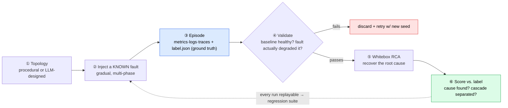

# Dataraft: You can't trust an AI to find root causes until you can score it. So we manufacture the ground truth.

*Repo: https://github.com/4sgupta828/samba · SimPy microservice simulator + whitebox RCA engine · ~17 physical fault modes · L1–L4 difficulty curriculum · ground-truth-labeled, fully-replayable incidents · MIT*

> **TL;DR for anyone betting on "AI for reliability":** The entire AIOps field has a measurement crisis — in production you almost never know the true root cause, so nobody can honestly grade an "AI SRE." Dataraft closes that gap by *authoring* incidents: it simulates realistic microservice systems, injects a **known** fault at a **known** node, emits production-grade *imperfect* telemetry, and ships an exact label — then runs a whitebox RCA engine against it and scores the answer. It's the benchmark that has to exist before "our AI does RCA" means anything.

---

## 1. The problem underneath the problem

Every vendor deck says "our AI finds root causes." Almost none can tell you *how often it's right*, because grading requires knowing the true answer — and the reason you needed RCA is that **you don't know the true answer.** Production telemetry has no ground-truth label. So the field evaluates itself on anecdotes and hand-picked incidents, and buyers can't distinguish a genuinely good RCA engine from a confidently wrong one.

This is not a tooling gap. It's an *evaluation* gap, and it's holding back the whole category. You cannot improve what you cannot measure, and you cannot sell trust you cannot demonstrate.

## 2. Why the obvious alternatives don't close it

| Approach | What it gives | Why it doesn't solve measurement |
|---|---|---|
| **Chaos engineering** (Chaos Monkey, Gremlin) | Breaks real systems on purpose | It injects faults but produces no *clean labeled dataset* at scale, and real telemetry is expensive, noisy, and non-reproducible |
| **Hand-labeled incident archives** | Some ground truth | Tiny, biased toward incidents someone bothered to write up, not reproducible, and never covers the long tail of fault × topology |
| **"Trust the demo"** | A good feeling | Selection bias; you see the incidents the tool solves, never the ones it botches |

The missing ingredient is *volume of realistic incidents with known root causes.* You can't collect that. You have to **generate** it.

## 3. The thesis: a closed benchmark loop, in one repo



The whole system simulates → labels → validates → diagnoses → **scores** — no external ML pipeline required. And the hard engineering is in making the generated data *honest*: realistic enough that winning on it means something.

## 4. Making the incidents hard on purpose (the part that matters)

A benchmark is only as good as its difficulty. Dataraft's telemetry is deliberately *imperfect* and physically plausible:

Faults are real, gradual, physical failure modes — not a flipped boolean:

```python
# src/failures/modes.py — ~17 modes, each with a clean revert
def cpu_saturation(component: ComputeAgent, params): ...
def memory_leak(component: ComputeAgent, params): ...   # ramps over time
def inject_latency(component, params): ...
def cache_failure(component, params): ...
def hot_shard(component: Service, params): ...          # skewed key → one node melts
```

| Realism knob | The RCA failure mode it forces the solver to survive |
|---|---|
| Gradual progression (warmup → ramp → full effect → recovery) | Realistic onset & propagation, not step functions |
| Propagation delays | Enforces *temporal causality* — cause must precede symptom in the data |
| Circuit breakers + retry storms | Manufactures genuine cascades — the exact thing RCA must untangle |
| Correlated 5×5 noise (CPU·Mem·Latency·Throughput·Error) | No clean oracle signal to key off |
| Fragility index **φ** (0→1) | Runs the system *near saturation*, where small faults cascade — the interesting regime |
| **Hard negatives** | Two different faults with near-identical signatures → tests real discrimination, not pattern-matching |

Generate a labeled dataset and score an RCA method in two commands:

```bash
python generate_dataset.py -n 100 --llm-topologies --phi 0.8   # φ = fragility
python analysis2/run_rca_batch.py data/data_<ts>               # whitebox RCA, scored vs. label
```

## 5. The whitebox RCA engine (why "whitebox," not a model)

Dataraft's own RCA engine is deliberately *explainable*, so it can be audited and so its wins are attributable to method, not luck. Four phases:

1. **Self-Health** — resource saturation + a "Limp Mode" deadlock detector (a node alive but not serving).
2. **Causal / physics coverage** — a causal-graph reasoner, temporal analysis, trace and log analysis.
3. **Ranking** — with a **Hub-Bias "Guilt Ratio"** correction (so the most-connected node isn't blamed just for being central) and traffic-spike-vs-retry-storm disambiguation.
4. **Storytelling** — a human-readable causal narrative, then `validate_ground_truth` scores it against the label.

The statistics are real: Mann-Whitney U, Cohen's d, and PELT/BinSeg changepoint detection (`ruptures`) — not a language model's intuition about which spike came first.

## 6. Decisions and tradeoffs

| Decision | Alternative rejected | What we gave up | Why |
|---|---|---|---|
| Simulate to get ground truth | Collect real incidents | Perfect realism | Reality gives you no labels and no volume; simulation gives both — at the cost of a sim-to-real validation story you must own |
| Deliberately *imperfect* telemetry | Clean synthetic signals | Easy, impressive-looking scores | A clean oracle makes any method look great and tells you nothing; the value is in the ambiguity |
| Gradual, physical faults | Instant on/off injection | Simplicity | Instant faults are trivially detectable; propagation and cascade are where RCA actually earns its keep |
| Whitebox RCA engine | A black-box model | Some raw accuracy, maybe | An RCA answer you can't explain is an RCA answer you can't trust or debug |
| Two validation gates before an episode counts | Trust the sim | Throughput | Baseline-health + structural validation ensure the dataset is *actually* a healthy-then-degraded incident, not garbage |
| Full replayability (`run_parameters.json`) | Fire-and-forget runs | Storage | Every incident becomes a fixed regression test for RCA methods |

## 7. The AI-vs-deterministic-code boundary

- **LLM's job:** design *plausible, varied* topologies with real architectural flavor (coverage and diversity), and narrate the causal story once the statistics have done the separation.
- **Code's job:** the physics (SimPy discrete-event simulation), the fault dynamics, the ground-truth label, and the RCA math (changepoints, statistical tests, causal-graph reasoning).

You cannot prompt your way to a ground-truth label, and you should not prompt your way to a causality claim. The model adds diversity and language; the simulator and the statistics add truth.

## 8. How you know it works — because measurement *is* the product

Everywhere else in AIOps, "how do you know it works" is hand-waved. Here it's the point: every episode is scored against `label.json` — did the engine name the right root-cause node, and did it separate cause from cascade? Two gates keep the benchmark itself honest:

- **Baseline-health validation** — the system must be measurably healthy *before* the fault and measurably degraded *after*, or the episode is invalid and retried (up to 3× with a new seed).
- **Structural validation** — required files, label schema, metrics covering the fault window.

The result is a benchmark you can point a competing RCA method (or an LLM agent) at and get an honest score — not a demo.

## 9. What stays genuinely hard (open problems)

1. **The sim-to-real gap** — does a method that wins on simulated incidents transfer to production? This is *the* open validation question for the whole approach.
2. **Hub bias** — blaming the most-connected node; the Guilt-Ratio correction helps but it's an active area.
3. **Traffic spike vs. retry storm** — same symptom, opposite cause; disambiguation separates real RCA from plausible RCA.

## 10. How to take it from here

- Publish the labeled episodes as a **public RCA benchmark + leaderboard** — the "ImageNet moment" for incident diagnosis.
- Score not just node-accuracy but cause-vs-cascade separation and explanation quality.
- Point LLM RCA agents (e.g., the sibling project **OATS**) at it and rank them honestly.

## 11. Use cases → products

| Use case | Product |
|---|---|
| Evaluate any RCA method | A benchmark + leaderboard for the AIOps industry |
| Train observability ML | Synthetic labeled incidents where real ones are scarce |
| Pre-production validation | A chaos/digital-twin harness you break on purpose |

## 12. To understand the space

Chaos engineering (Chaos Monkey, Gremlin) · discrete-event simulation (SimPy) · OpenTelemetry · causal inference for RCA · changepoint detection (PELT, BinSeg, `ruptures`) · digital twins · the RCA-benchmark literature.

---

*Before we can trust AI to find root causes, we have to be able to score it — and that means manufacturing the ground truth reality won't give us.*

**#AIOps #SRE #Observability #RCA #ChaosEngineering #Benchmarking #MLSystems #SimulationScience #ProductManagement**
