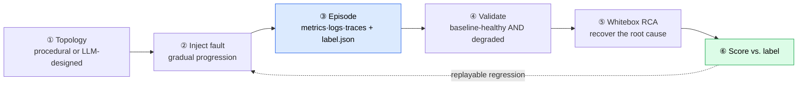

# Dataraft: You can't benchmark a root-cause-analysis AI when you never know the real root cause. So we manufacture it.

*Repo: https://github.com/4sgupta828/samba · SimPy microservice simulator · ~17 fault modes · L1–L4 curriculum · ground-truth-labeled incidents · MIT*

---

## A quietly fundamental problem in AIOps

Everyone is building AI to do root-cause analysis. Almost no one can *measure* whether it works — because **in production you rarely know the true root cause** (that's the whole reason you needed RCA). So the field grades itself on anecdotes. You can't improve what you can't score, and you certainly can't trust an "AI SRE" you couldn't grade.

## Framed as a research problem

| | |
|---|---|
| **Missing ingredient** | A dataset of realistic incidents with *known* root causes |
| **Why it's missing** | Real telemetry has no ground-truth label; you have to **author** the incident |
| **Approach** | Simulate systems → inject a *known* fault → emit *imperfect* observability → label it → run RCA → **score vs. label** |
| **Central claim** | Simulation buys you the two things reality won't: **ground truth** and **volume** — at the cost of a sim-to-real validation story |
| **Design constraint** | The data must be *hard*: gradual faults, propagation delay, cascades, and "hard negatives" (different faults, similar signatures) |

## The closed loop



Faults are real, gradual, physical failure modes — not a flipped boolean:

```python
# src/failures/modes.py — ~17 modes, each with a clean revert
def cpu_saturation(component: ComputeAgent, params): ...
def memory_leak(component: ComputeAgent, params): ...   # ramps over time
def inject_latency(component, params): ...
def cache_failure(component, params): ...
def hot_shard(component: Service, params): ...          # skewed key → one node melts
```

Generate a labeled dataset in one command:

```bash
python generate_dataset.py -n 100 --llm-topologies --phi 0.8   # φ = fragility (run near saturation)
python analysis2/run_rca_batch.py data/data_<ts>               # whitebox RCA, scored vs. label
```

## What makes the data *hard* (and honest)

| Realism knob | Why it matters for RCA |
|---|---|
| Gradual multi-phase faults (warmup→ramp→full→recovery) | Realistic onset & propagation, not step functions |
| Propagation delays | Enforces *temporal* causality (cause precedes symptom) |
| Circuit breakers + retry storms | Produces genuine cascades — the thing RCA must untangle |
| Correlated 5×5 noise (CPU·Mem·Latency·Throughput·Error) | No clean oracle signal |
| **Hard negatives** | Two faults with near-identical signatures → tests real discrimination |

## What AI solves — and what it doesn't

| Task | Owner |
|---|---|
| Design plausible, varied topologies & scenarios (coverage) | **LLM** (great at diversity) |
| Narrate a causal story once the stats separate cause from symptom | **LLM** |
| Decide if a spike is cause or symptom | **Statistics** (Mann-Whitney U, Cohen's d, PELT changepoints) — deliberately *whitebox* |
| Produce ground truth | **The simulator** — you cannot prompt your way to a label |

## What stays genuinely hard (open problems)

1. **Sim-to-real gap** — does an RCA method that wins on simulated incidents transfer to prod? This is *the* validation question and it's open.
2. **Hub bias** — blaming the most-connected node just because everything routes through it. Dataraft's engine applies a "Guilt Ratio" correction; it's an active area.
3. **Traffic spike vs. retry storm** — same symptom, opposite cause. Disambiguation separates a real RCA engine from a plausible one.

## How to take it from here

- Grow the fault library + topology diversity; publish the labeled episodes as a **public RCA benchmark** (an "ImageNet moment" for incident diagnosis).
- Score not just "named the node" but "separated cause from cascade *and explained it.*"
- Feed it LLM RCA agents (e.g., the sibling project **OATS**) and rank them honestly.

## Use cases → products

| Use case | Product shape |
|---|---|
| Evaluate any RCA method | A benchmark + leaderboard for AIOps |
| Train observability ML | Synthetic labeled incidents where real ones are scarce |
| Pre-production validation | A chaos/digital-twin harness you break on purpose |

## To understand this space better

Chaos engineering (Chaos Monkey, Gremlin) · discrete-event simulation (SimPy) · OpenTelemetry · causal inference for RCA · changepoint detection (PELT, `ruptures`) · digital twins.

---

*Before we can trust AI to find root causes, we have to be able to score it — and that means manufacturing the ground truth reality won't give us.*

**#AIOps #SRE #Observability #RCA #ChaosEngineering #Benchmarking #MLSystems #ProductManagement**
